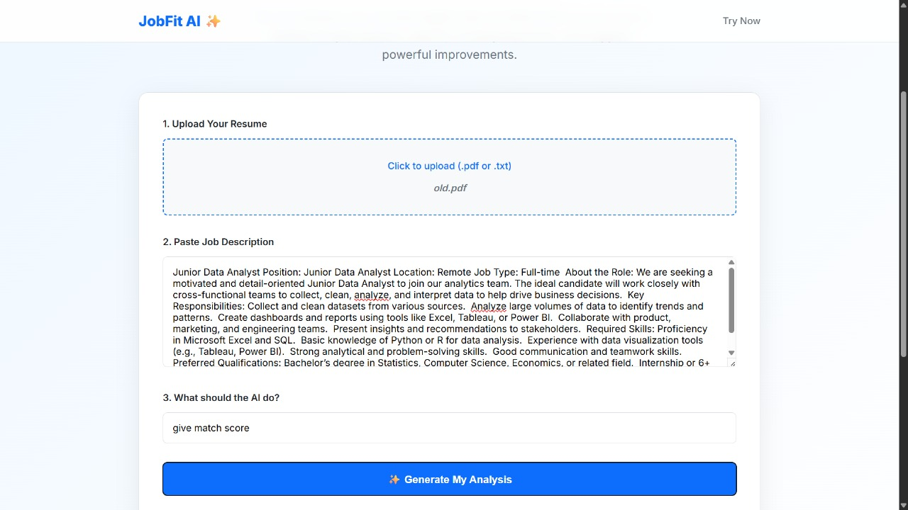

# JobFit AI ✨

Modern AI Resume Analyzer — No Backend Required

---

## 🚀 Overview

**JobFit AI** is a modern, no-backend web app that analyzes your resume against any job description using an AI agent built in [Langflow](https://langflow.org/).  
With just a single HTML file and a Langflow agent, it delivers:

- **Fit-Gap Analysis**
- **Match Score (%)**
- **Missing Skills/Keywords Detection**
- **Personalized Cover Letter Generation**

All AI logic runs remotely via your Langflow API—no custom server or backend needed!

---

## 🖥️ Live Demo UI

The entire frontend is a single `index.html` file.  
You can upload your resume (`.pdf` or `.txt`), paste a job description, enter your request (e.g., "give match score", "find missing skills", "generate cover letter"), and get instant AI-powered output.

### Main Features

- **Resume Upload:** Drag & drop or click to select `.pdf` or `.txt` file.
- **Job Description Paste:** Paste any job ad or description.
- **Flexible AI Prompts:** Ask for match %, missing skills, cover letter, or any custom instruction.
- **Rich Output:** See formatted AI responses instantly — match scores, skill gaps, or a tailored cover letter.

---

## ⚡ How It Works

1. **Frontend (`index.html`):**
    - Handles file upload and PDF/text extraction (via [PDF.js](https://mozilla.github.io/pdf.js/))
    - Collects job description and user prompt
    - Sends all data as a JSON payload to the Langflow API endpoint

2. **AI Agent (Langflow):**
    - Receives resume text, job description, and user request
    - Chooses the right tool:
        - Match score computation
        - Missing skills/keywords extraction
        - Cover letter generation
    - Returns results, which are shown on the page

3. **No Backend Code:**  
    - The HTML file communicates directly with the Langflow agent via HTTP API (set in the JS)

---

## 🛠️ Setup & Usage

### 1. Clone or Download

Download or clone this repository.

### 2. Configure Your Langflow Agent

- Import the provided `Job fit Ai.json` into your Langflow instance.
- Ensure your Langflow API is running and accessible (default: `http://localhost:7860`).
- Obtain your Langflow API key.

### 3. Adjust Endpoint/API Key in HTML

In the `<script>` section of your `index.html`, update:

```js
const res = await fetch("http://localhost:7860/Your_langflow_address", {
  method: "POST",
  headers: {
    "Content-Type": "application/json",
    "x-api-key": "your langflow api key"
  },
  body: JSON.stringify(payload)
});
```
- Set the API endpoint and `x-api-key` to match your Langflow instance.
- `aaaca439-7bd4-4db7-9996-ab07c2420415` is the flow ID for your imported agent.

### 4. Open `index.html` in Your Browser

No server needed!  
Just open the file locally or host it statically.

---

## 🧠 About the Langflow Agent (`Job fit Ai.json`)

- **Core Tools:**
    - `analyze_match_score`: Returns a % match and explanation
    - `find_missing_skills`: Lists missing skills & improvements
    - `generate_cover_letter`: Writes a personalized cover letter

- **Inputs:**
    - Resume (`.pdf`/`.txt`)
    - Job Description (text)
    - User Prompt (custom instruction)

- **LLM:**  
    - Powered by Groq (Llama3 or other fast LLMs)

- **How it works:**  
    - The agent dynamically selects the right tool based on your prompt and combines resume & job description for analysis.

---

## 🖼️ UI & Experience

- Fully responsive, modern SaaS-inspired design
- Drag/drop or click-to-upload resume
- Clean, rich output formatting
- Real-time status and error feedback

---

## 📦 File Structure

```
index.html            # The complete frontend app (HTML+CSS+JS)
Job fit Ai.json       # Langflow agent flow (import in Langflow)
```

---

## 🔒 Security & Privacy

- All processing happens via your Langflow AI instance.
- No resume or job data is stored anywhere in this app.
- Keep your Langflow API key secure!

---

## 📝 Customization

- **Change UI:**  
  Edit `index.html` for branding, theme, or extra fields.
- **Change Agent Logic:**  
  Edit or extend `Job fit Ai.json` in Langflow to add more tools (e.g., interview Q&A, resume rewrite).

---

## 📸 Screenshots

| Main UI | Input | Output | Agent Flow |
|---------|-------|--------|-----------|
|  |  |  |  |


---

## 🙌 Credits

- **Made by:** Sourabh
- **Agent Flow:** Built in [Langflow](https://langflow.org/) (visual LLM orchestration)
- **LLM:** [Groq](https://groq.com/) API

---

*Empower your job search with AI — No backend, no hassle!*
